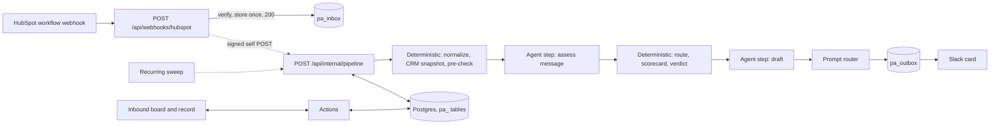

# PA App Technical Spec (Slice 1: Inbound)

- **Status:** Draft v1, 2026-09-29
- **Framework:** `@agent-native/core` 0.176.4, the xDR Hub workspace pin (D33).
  The kit was drafted against 0.197.0; re-verified facts are in D34 and D38.
- **Read with:** `PRD.md` for intent and `DECISIONS.md` for settled calls

## 1. Architecture at a glance



Principles:

- Code decides wherever a rule can decide. Agent steps run only where
  judgment is needed, with narrow tools and typed save actions.
- Everything is persisted. A crash at any step resumes from the database.
- Every external call goes through the gateway.
- Every decision leaves a receipt.

## 2. Framework facts this design depends on

Drafted against 0.197.0. The workspace runs 0.176.4 (D33). Re-verify each
row against the installed version before relying on it, and record any drift
in `DECISIONS.md` (D34 and D38 hold the checks done so far).

| Fact                                                                                                          | Where it is documented                              | How we use it                                                                         |
| ------------------------------------------------------------------------------------------------------------- | --------------------------------------------------- | ------------------------------------------------------------------------------------- |
| `defineAction` actions are agent tools, UI hooks, HTTP, CLI, MCP, and A2A tools at once                       | `key-concepts`, `actions-*`                         | All operations are actions                                                            |
| No inline LLM calls; AI goes through the agent                                                                | `key-concepts` (rule 2)                             | Agent steps run through the framework's agent                                         |
| Inbound webhooks need custom Nitro routes to read the raw body                                                | `server-routes`                                     | `/api/webhooks/hubspot`, `/api/slack/interactions`                                    |
| Webhook pattern: SQL queue, return 200, self-fired processor, retry sweep capped at 3                         | `integration-webhooks` skill                        | Pipeline intake                                                                       |
| Server-side agent loop for orchestration surfaces, with processors                                            | `agent-surfaces` (`runAgentLoop`), `processors`     | Agent steps (default choice, D3)                                                      |
| Event automations (`registerEvent`, `emit`, `jobs/*.md`) run as their creator                                 | `automations`                                       | Alternative for agent steps                                                           |
| ~~Recurring sweep handler hook~~                                                                              | **Not in 0.176.4.** The driver is open (D34)        | Clocks, retries, backstop poll                                                        |
| On Netlify the workspace deploy emits a per-app, per-minute recurring-jobs trigger; its sweep runs agent jobs | `recurring-jobs`; `dist/deploy/workspace-deploy.js` | Candidate driver only (D34)                                                           |
| `needsApproval` pauses the agent before a side effect                                                         | `actions-access-control`                            | `send-first-touch`, CRM writes                                                        |
| The built-in Slack adapter handles conversations and its own approve, deny, and cancel controls only          | `dist/integrations/plugin.js`                       | A separate Slack app and route for cards (D6)                                         |
| Postgres via Drizzle, PGlite locally, `runMigrations` with a unique name                                      | `server-database`, `neon`                           | `pa_` tables and app-owned migrations                                                 |
| Workspace apps share one `DATABASE_URL` by default                                                            | `multi-app-workspace`                               | `pa_` prefix on every table                                                           |
| Vault, workspace connections, and a provider API runtime for HubSpot, Slack, and Gmail                        | `integrations`, `workspace-connections`             | Credentials are never hand-rolled; HubSpot uses the shared client and vault key (D35) |
| Feature flags with rules and percentage rollout                                                               | `actions-advanced` (`defineFeatureFlag`)            | Modes and design partners (D12)                                                       |
| CI eval gate: `*.eval.ts`, `defineEval`, scorers, promotion from traces                                       | `evals`                                             | Quality gate for agent steps                                                          |
| Audit log at the action seam, with an audit target per action                                                 | `audit-log`                                         | Who changed what                                                                      |
| Skills with `scope: runtime` or `scope: dev`; small `AGENTS.md`; `CLAUDE.md` as a symlink                     | `skills-guide`, `writing-agent-instructions`        | Instruction layout                                                                    |

## 3. Repository layout

```
xdr-hub/                         existing workspace (Dispatch plus apps, D33)
  AGENTS.md                      workspace instructions, plus a short PA section
  packages/shared/               shared HubSpot client, roles, voice (D35)
  apps/pa/
    docs/                        PRD, SPEC, OUTLINE, DECISIONS, SOURCES, CONTEXT, CHANGELOG, BASELINE
    AGENTS.md                    small runtime file (CLAUDE.md is a symlink to it)
    DESIGN.md                    visual direction
    agent-native.json            onboarding config
    actions/                     defineAction files, thin, calling server/core
    app/                         routes and components
    server/
      routes/api/webhooks/hubspot.post.ts
      routes/api/internal/pipeline.post.ts      signed self-call target
      routes/api/slack/interactions.post.ts     M2
      plugins/db.ts                             migrations
      plugins/pa.ts                             sweep, events, flags, secrets
      core/                      domain modules, testable without the framework
        identity/ objects/ events/ receipts/ pipeline/ precheck/ routing/
        scorecard/ drafting/ playbook/ crm/ gateway/ notify/ outbox/ clocks/
    playbook/                    versioned YAML entries (seed: inbound-v1.yaml)
    config/                      hubspot-mapping.yaml, routing-pool.yaml (no secrets)
    evals/                       *.eval.ts for agent steps
    fixtures/                    synthetic cases, recorded provider responses
    test/                        unit, contract, integration
    .agents/skills/              runtime skills, plus dev skills with scope: dev
```

Actions and routes stay thin. Domain logic lives in `server/core` and is unit
tested without the framework.

## 4. Data model

Postgres, every table prefixed `pa_`. Conventions: text ULID ids;
`created_at` and `updated_at`; an integer `version` for optimistic locking on
mutable rows; `jsonb` snapshots carry `source` and `fetched_at`; events,
receipts, and playbook releases are append-only; nothing is hard-deleted.

| Table                  | Purpose                                                                                                        | Key columns and constraints                                                                                                                                                                                                                                                                         |
| ---------------------- | -------------------------------------------------------------------------------------------------------------- | --------------------------------------------------------------------------------------------------------------------------------------------------------------------------------------------------------------------------------------------------------------------------------------------------- |
| `pa_inbox`             | Raw deliveries; the work queue                                                                                 | `source`, `external_id` (unique per source), `received_at`, `signature_ok`, `payload`, `status` (pending, processing, done, failed, skipped), `attempts`, `last_error`, `next_attempt_at`                                                                                                           |
| `pa_submissions`       | Parsed form fills                                                                                              | `inbox_id`, `form_id`, `submitted_at`, `email`, `name`, `company_name`, `message` (untrusted), `fields`, `crm_contact_ref`, `page_url`                                                                                                                                                              |
| `pa_accounts`          | Companies                                                                                                      | `domain` (unique), `name`, `crm_company_ref`, `flags` (agency, partner, protected, restricted_country, each with who set it and when), `firmographics`                                                                                                                                              |
| `pa_contacts`          | People                                                                                                         | `email` (unique, normalized), `name`, `title`, `account_id`, `crm_contact_ref`, `language`, `opt_out`                                                                                                                                                                                               |
| `pa_engagements`       | One per motion episode                                                                                         | `account_id`, `contact_id`, `motion` (contact_sale now), `state`, `owner_user_id`, `owner_source`, `route_reason`, `relationship_state`, `first_touch_due_at`, `decision_due_at`, `first_touch_at`, `outcome`, `attached_to_id`, `playbook_release_id` (pinned), `mode` (shadow or live), `version` |
| `pa_events`            | Append-only domain events                                                                                      | `engagement_id`, `type`, `actor` (system, agent:step, user:id), `payload`, `receipt_id`, `occurred_at`                                                                                                                                                                                              |
| `pa_assessments`       | Message understanding                                                                                          | `engagement_id`, `intent`, `agency_signal`, `evidence_quotes`, `end_client_named`, `product_interest`, `language`, `explicit_question`, `receipt_id`                                                                                                                                                |
| `pa_scorecards`        | Qualification output, one writer                                                                               | `engagement_id`, `version`, `verdict`, `reason_codes`, `answers` (question, answer, source, as_of, confidence), `hypothesis`, `receipt_id`                                                                                                                                                          |
| `pa_drafts`            | First-touch drafts                                                                                             | `engagement_id`, `subject`, `body`, `cta`, `language`, `status` (proposed, approved, edited, sent, discarded), `used_entry_ids`, `lint`, `edited_body`, `edit_reasons`, `approved_by`, `receipt_id`                                                                                                 |
| `pa_receipts`          | Why each decision happened                                                                                     | `kind`, `engagement_id`, `playbook_release_id`, `entry_versions`, `rule_results`, `inputs` (references), `agent_run_id`, `tool_calls`, `model`, `created_at`                                                                                                                                        |
| `pa_outbox`            | Side effects, exactly once                                                                                     | `kind` (slack_post, slack_update, slack_reply, email_send, crm_write), `idempotency_key` (unique), `payload`, `status` (pending, sending, sent, failed, dead), `attempts`, `next_attempt_at`, `provider_ref`, `last_error`                                                                          |
| `pa_notifications`     | Card to Slack message mapping                                                                                  | `engagement_id`, `user_id`, `slack_channel`, `slack_ts`, `last_rendered_hash`                                                                                                                                                                                                                       |
| `pa_provider_calls`    | Gateway ledger                                                                                                 | `provider`, `operation`, `idempotency_key`, `status`, `http_status`, `duration_ms`, `cost_units`, `decision_ref`                                                                                                                                                                                    |
| `pa_playbook_releases` | Immutable releases                                                                                             | `id` (content hash), `entries`, `label` (shadow, canary, production), `created_at`                                                                                                                                                                                                                  |
| `pa_labels`            | Eval labels                                                                                                    | `submission_id`, `labeler`, `expected_route`, `expected_verdict`, `expected_first_move`, `notes`                                                                                                                                                                                                    |
| `pa_corrections`       | Every human correction                                                                                         | `target_kind`, `target_id`, `reason_code`, `note`, `user_id`, `receipt_id`                                                                                                                                                                                                                          |
| `pa_user_profiles`     | PA-only fields for people on our side; roles and HubSpot ids come from the shared `workspace_user_roles` (D35) | `email` (joins `workspace_user_roles`), `slack_user_id`, `timezone`, `working_hours`, `in_round_robin`, `is_design_partner`                                                                                                                                                                         |

Migrations use `runMigrations` from `@agent-native/core/db` with the unique
name `pa`, are additive only, and never use `drizzle-kit push` against
production.

## 5. The pipeline

### 5.1 Intake route

`POST /api/webhooks/hubspot`:

1. Read the raw body and verify the signature for the configured path, with
   a constant-time compare, failing closed:
   - Workflow "Send a webhook" action: `X-HubSpot-Signature` version v2, the
     SHA-256 of app client secret + method + URI + unparsed body.
   - App webhook subscriptions: `X-HubSpot-Signature-v3`, the base64
     HMAC SHA-256 of method + URI + body + timestamp, keyed with the client
     secret. Reject timestamps older than 5 minutes.
2. Insert into `pa_inbox`. The unique `(source, external_id)` key makes
   retries a no-op that still returns 200.
3. Fire the processor with a signed self POST to `/api/internal/pipeline`,
   without awaiting its work, following the framework's `integration-webhooks`
   pattern.
4. Return 200 in under a second.

Backstop: every 10 minutes the sweep asks HubSpot for recent Contact Sales
submissions and enqueues any that are missing, under the same unique key.

### 5.2 Processor

`POST /api/internal/pipeline` verifies its HMAC, claims the inbox row
atomically (pending to processing, attempts plus one), runs the steps, and
marks the row done or failed. The sweep re-fires rows stuck in pending or
processing, up to 3 attempts, then marks them failed and alerts.

### 5.3 Steps

Every step is idempotent, goes through `server/core`, appends events, and
writes a receipt. A step returns one of: done, skip, retry (transient), fail,
or halt (a terminal outcome such as ignored).

| #   | Step           | Kind                                | Output                                                                                                |
| --- | -------------- | ----------------------------------- | ----------------------------------------------------------------------------------------------------- |
| 1   | normalize      | Deterministic                       | Submission row; contact and account upserted; engagement created or attached                          |
| 2   | crm_snapshot   | Deterministic, CRM port             | Lifecycle, owners, open deals, customer flags, recent activity, product signals, each with fetch time |
| 3   | precheck       | Deterministic rules                 | Outcome and reason codes                                                                              |
| 4   | assess_message | Agent step                          | `pa_assessments`, through `save-message-assessment`                                                   |
| 5   | route          | Deterministic rules                 | Owner, owner source, relationship state, route reason, clocks                                         |
| 6   | score          | Deterministic, using the assessment | `pa_scorecards`: verdict, reasons, sourced answers                                                    |
| 7   | draft          | Agent step                          | `pa_drafts`, through `save-draft`, with lint results                                                  |
| 8   | notify         | Deterministic, router               | Outbox `slack_post`; `pa_notifications` row                                                           |

Steps 4 and 7 are skipped when an earlier step settles the outcome, for
example attach to the existing owner or ignored junk.

### 5.4 Agent steps

- Run through the framework's agent, never through direct model calls. The
  default is the server-side agent loop from the processor, with a narrow
  tool list and processors. The alternative is event automations. Choose
  after reading `integration-webhooks`, `agent-surfaces`, `processors`, and
  `automations`, and record the choice (D3).
- Tools per step:
  - `assess_message`: `get-inbound-context` (read-only, bounded) and
    `save-message-assessment`.
  - `draft`: `get-inbound-context`, `resolve-playbook`, `get-playbook-entry`,
    and `save-draft`.
- Output goes only through the save actions, which have zod schemas. Server
  validation then checks:
  - Every evidence quote is an exact substring of the message.
  - The language is a supported code.
  - Every `used_entry_id` exists in the pinned release.

  On a validation failure the agent sees the error and may retry twice.
  After that the step fails to human review.

- The form message is wrapped as quoted data between explicit delimiters,
  with a note that it may contain instructions to ignore. The steps get no web
  access, no URL fetching from form text, and no other tools.
- Models are configuration. Defaults: `claude-haiku-4-5` for
  `assess_message` and `claude-sonnet-5-5` for `draft`. Verify the IDs in the
  models docs at build time. Do not set `temperature`, `top_p`, or `top_k`,
  because some current models reject non-default values.
- The receipt records the agent run id and the tool calls from the run
  trace, never from the model's own account of what it did.

### 5.5 Draft lint

Deterministic, before a draft is shown to anyone. A draft fails when it:

- contains an em dash or en dash
- has more than one call to action
- is missing the calendar link when the call to action is a meeting
- falls outside the message rule's word range
- uses a banned phrase from the message rules
- leaves an explicit question with neither an answer nor an "I'll confirm"
  line
- names a customer without an approved reference entry

On failure, the agent gets one retry with the lint result. After that, the
draft is flagged for a human edit.

## 6. Routing and clocks

- **Relationship state** comes from the CRM snapshot plus the assessment:
  owned (an active contact or company owner), open deal, customer, churned,
  agency (the assessment signal or an account flag), or new.
- **Routing order:**
  1. The existing active owner
  2. The open deal or customer owner
  3. The partner rep, for agencies
  4. Round robin among users who are in the pool, in working hours, and not
     out of office
- **SAL or later with recent activity counts as owned.** A stale SAL (the
  threshold is a playbook entry) is reopened deliberately, and the card says
  so.
- **Clocks:** `first_touch_due_at` comes from the SLA entry (proposed: 60
  working minutes). `decision_due_at` is 24 hours, per step 2b of the Contact
  Sales doc. Clocks use the owner's working hours and timezone.
- **Escalation, run by the sweep:** at 75% of the first-touch clock, one
  thread reply to the owner. At breach, notify the PA lead and record a
  breach event.

## 7. Prompt router and Slack card

**Tiers:**

- T1 interrupt: a new lead to its owner, or a breach to the PA lead.
- T2 thread reminder: the clock is at risk.
- T3 in-app only: everything else.

**Caps:** one card per engagement and at most one reminder. Quiet hours are
set per user, with a fast-lane exception for contact sales configured in the
playbook.

**Card content, as Block Kit:**

- New contact sale: {name}, {company} ({industry, location if known})
- What they asked, in one sentence
- The route and why, for example "Already SAL, routed to its current owner"
  or "Agency for an unnamed client, routed to partner rep"
- The recommended next step
- Context line: the clock ("Waiting 38 min" or "Due 10:22 AM PT") and the
  short release id
- Buttons: Open record (link) in M1; Approve draft, Edit, Not mine, and Open
  record in M2

**Updates:** `chat.update` on every state change ("Sent 12 min after submit,"
"Replied," "Meeting booked"). Always set the text fallback. Escape `&`, `<`,
and `>` in untrusted text; form text must never create a mention or a link.
Set `unfurl_links` and `unfurl_media` to false.

**Slack app:** its own app, "PA Inbound," with only the bot scopes it uses.
Verify each in Slack's docs; expected: `chat:write`, `im:write`,
`users:read`, `users:read.email`. DM with `conversations.open` then
`chat.postMessage`.

**Interactivity (M2)** at `/api/slack/interactions`:

1. Verify the v0 signature: HMAC SHA-256 of `v0:{timestamp}:{raw body}`
   with the signing secret. Reject timestamps older than 5 minutes.
2. Acknowledge with 200 within 3 seconds.
3. Enqueue the work, then update the message.

A `response_url` allows 5 uses within 30 minutes, so prefer `chat.update`
with the stored `ts`.

## 8. Integrations

### 8.1 HubSpot

- **Ingestion.** Preferred: a workflow on Contact Sales form submission with
  the "Send a webhook" action (Data Hub Professional or Enterprise), method
  POST, authenticated by request signature with the app id. Fallback: app
  webhook subscriptions with the v3 signature. Backstop: the poll.
- **Reads, through the CRM port only:** the contact by id or email with
  mapped properties, the associated company, open deals, and owners. Property
  names live in `config/hubspot-mapping.yaml` (lifecycle, owner, fit score,
  QL score, product signal, the SAL stage value). Confirm them with RevOps and
  read them from the properties API in M0.
- **Writes, M2 and M3.** Log each sent email as an email engagement:
  `POST /crm/v3/objects/emails` with `hs_timestamp`, `hubspot_owner_id`,
  `hs_email_direction` EMAIL, `hs_email_status` SENT, the subject, the text,
  and an association to the contact. Lifecycle and scorecard writes are
  proposals the owner approves.
- **Limits.** One limiter for HubSpot, shared by every caller. Honor 429s
  and the rate-limit headers, and batch where the API supports it.
- **Credentials (D47).** The app owner saves the HubSpot token on `/crm`; it
  is stored encrypted at org scope as `HUBSPOT_ACCESS_TOKEN`. OAuth for
  HubSpot and Salesforce goes through the framework's workspace connections.
- **Mapping (D48).** Property definitions are read into `pa_crm_schema`; the
  mapping is a RevOps-owned playbook block with typed canonical fields.
- **Auth.** Use the workspace-shared HubSpot client and vault key
  (`hubspotFetchWithTimeout`, `HUBSPOT_ACCESS_TOKEN`, D35), called inside
  the owner's request context for background work. The workflow
  signature needs the developer app's client secret as a registered secret.

### 8.2 Slack

See section 7.

### 8.3 Gmail (M2)

Send from the owner's mailbox using the framework's Google OAuth and Gmail
provider plumbing. Read the Mail template developer docs first; do not write a
new Gmail client. Booking's `sendFollowupEmail` shows the raw message format;
its Google sign-in scopes lack `gmail.send`, and every sign-in overwrites the
stored token's scopes, so PA's scope list is settled with booking's in M2. `send-first-touch` has `needsApproval: true` and goes
through the outbox with an idempotency key. Store the Gmail message id and
thread id, then log the email to HubSpot.

### 8.4 Model provider

Through the framework engine only (`ANTHROPIC_API_KEY` or Builder connect).
No SDK calls in app code.

### 8.5 Hosting

The xDR Hub root workspace deploy to the existing `xdr-hub` Netlify site,
mounted at `/pa` (D33). No per-app `netlify.toml`. `DATABASE_URL`,
`BETTER_AUTH_SECRET`, and `A2A_SECRET` are workspace settings shared with
the other apps; confirm `A2A_SECRET` is set on the site (D34). Leave keep-warm off
unless needed, because it prevents Neon from autosuspending.

## 9. Provider gateway

Every external call goes through `server/core/gateway`, in five steps. For
HubSpot, the call step uses the shared `hubspotFetchWithTimeout` (D35); the
gateway adds the limiter, retries, breaker, and ledger around it.

1. **Reuse:** return a fresh cached value when the operation allows it (TTL
   per operation).
2. **Budget:** paid or metered calls need a budget and a decision reference,
   and fail closed when over.
3. **Throttle:** one token bucket per provider, shared by all callers.
4. **Call:** a timeout; an idempotency key for writes; retries only on
   retryable errors, with exponential backoff and jitter; `Retry-After`
   honored on 429; a circuit breaker per provider.
5. **Record:** a `pa_provider_calls` row with cost units and the receipt that
   justified the call.

Credentials come from the framework's provider runtime or vault. The gateway
never stores tokens.

## 10. CRM port

Canonical types only; adapters translate.

```ts
export interface CrmPort {
  findContactByEmail(email: string): Promise<CrmContact | null>;
  getContact(ref: CrmRef): Promise<CrmContact>;
  getCompanyForContact(ref: CrmRef): Promise<CrmCompany | null>;
  listOpenDeals(company: CrmRef): Promise<CrmDeal[]>;
  listOwners(): Promise<CrmOwner[]>;
  logEmail(input: LogEmailInput, idempotencyKey: string): Promise<CrmRef>; // M2
  proposeWrite(change: CrmChange): Promise<string>; // M3, approval first
}
```

Contract tests run each adapter against recorded fixtures. No HubSpot types
appear outside the adapter.

## 11. The playbook (dynamic, D44; blocks, D46)

- Block types live in `shared/playbook-blocks.ts`; instances are entries with
  `block`, `section`, and `position`, whose `params` are the block's data.
  The routing pool and the HubSpot mapping are config blocks. The seed lives
  in `playbook/*.yaml` and `config/*.yaml` and is imported once.
- Releases are immutable and content-hashed (`pa_playbook_releases`); the
  `active` label (`pa_release_labels`) is the one pointer that moves.
- Changes are change sets (`pa_playbook_changes`, `pa_playbook_change_items`),
  checked in code (block schemas, evaluators, supported values, CRM fields,
  the portal schema) and replayed before review, then approved by every
  owning team (`pa_playbook_approvals`).
- `capabilities.ts` is what code evaluates. A block without an evaluator
  publishes as `pending_build`, never evaluated, and its block type's build
  brief goes to the app owner.
- Findings become suggestions (`pa_suggestions`), delivered in the app and by
  Slack DM (D45), and closed automatically once a publish resolves them.

## 12. Actions (initial catalog)

| Action                                   | Caller         | Notes                                             |
| ---------------------------------------- | -------------- | ------------------------------------------------- |
| `list-inbound`                           | UI, agent      | Filters: mine, team, state, at risk               |
| `get-engagement`                         | UI, agent      | Timeline, scorecard, draft, receipts              |
| `get-receipt`                            | UI, agent      | Read-only                                         |
| `get-inbound-context`                    | Agent steps    | Bounded and read-only; the message as quoted data |
| `save-message-assessment`                | Agent only     | zod schema plus server validation                 |
| `save-draft`                             | Agent only     | zod schema plus lint                              |
| `resolve-playbook`, `get-playbook-entry` | Agent          | Pinned release only                               |
| `approve-draft`, `edit-draft`            | UI, Slack (M2) | An edit requires a reason                         |
| `send-first-touch`                       | UI (M2)        | `needsApproval: true`; outbox                     |
| `reassign-engagement`                    | UI, Slack (M2) | Reason required                                   |
| `record-correction`                      | UI             | Reason codes                                      |
| `label-submission`                       | UI             | Eval labels                                       |
| `replay-submission`                      | Admin, CLI     | Runs against a chosen release in shadow           |
| `pipeline-health`                        | UI, agent      | Throughput, failures, latency, cost               |
| `set-mode`                               | Admin          | Through feature flags                             |

Every mutating action declares an audit target. Keep `navigate` and
`view-screen` current with the app's state keys.

## 13. UI surfaces

- **Inbound board** (`/inbound`): one row per lead with what it was
  classified as (and why), the drafted reply's subject and first lines, and
  the owner and SLA timer (D51). Filters, and at-risk items first (D49).
- **Engagement record** (`/inbound/:id`), triage first (D49):
  - A compact header with who, company, owner, and the sales cycle (MQL, QL,
    SAL, S0, NBM booked, NBM complete, S1) with the SLA timer (D51)
  - How it was classified: label, why, their question, then the next step
  - The drafted reply as an email, with the lint result, copy, and "ask the
    agent to revise" (inline edit and reason chips arrive in M2)
  - Under Details, collapsed: the full message and assessment, pre-check,
    route, scorecard, SLA timer, timeline, and receipts
  - `j` and `k` step through the board's queue
- **Labeling** (`/labels`): one submission at a time, recording the expected
  route, verdict, and first move. Keyboard-first.
- **Pipeline health** (`/ops`): counts, failures, stuck items, p95 latency,
  cost, and replay.
- **Settings** (`/settings`): mode, design partners, routing pool, working
  hours.

**App state:** `navigation` holds `{ view, engagementId?, filters }`, and
`selection` holds `{ engagementIds }`.

**Visual direction** for `DESIGN.md`: a calm operations console, one accent
color for the primary action, dense but readable tables, and Tabler icons.
No decorative AI icons.

## 14. Security and privacy

- Signatures are verified on every inbound route, failing closed, with replay
  windows enforced.
- Secrets live in the framework vault, with least-privilege scopes. Nothing
  secret goes in YAML, fixtures, or logs.
- Form text is untrusted everywhere: in prompts, in Slack, and in the UI. It
  is escaped, never executed, and never followed.
- Store only the personal data the workflow needs. Raw payloads are retained
  for 90 days (proposed). Fixtures are synthetic. Data requests follow the
  framework's privacy guide.

## 15. Observability

- Every log line and event carries a correlation id: the inbox id, then the
  engagement id.
- Agent steps use the framework's traces. Pipeline metrics come from
  `pa_events`. Alerts fire on failure rate, stuck items, and breaches.

## 16. Testing

| Layer       | What it covers                                                                                                         | Tooling                           |
| ----------- | ---------------------------------------------------------------------------------------------------------------------- | --------------------------------- |
| Unit        | Rules, state machine, clocks, lint, validators, identity                                                               | Vitest                            |
| Contract    | HubSpot and Slack adapters against recorded fixtures and signature vectors from the docs                               | Vitest                            |
| Integration | The pipeline end to end with fake providers: duplicates, retries, timeouts, out-of-order events                        | Vitest                            |
| Evals       | `assess_message` and `draft` on labeled cases; custom scorers for route and verdict; `llmJudge` for "answered the ask" | The framework eval gate           |
| Replay      | Historical submissions through the current release, compared to labels                                                 | `replay-submission` plus a report |

These failure tests must pass before M1:

- a duplicate webhook
- a forged signature
- HubSpot 429 and 5xx responses
- a Slack rate limit
- a model timeout
- invalid agent output
- a processor crash mid-step
- recovery by the sweep

## 17. Performance and cost budgets

- Webhook acknowledgment under 1 second at p99.
- The card within 2 minutes of submission at p95.
- Deterministic steps under 10 seconds.
- Agent steps bounded by per-step timeouts.
- Cost per inbound tracked, with a target set after M1.

## 18. Environments and configuration

- **Local:** PGlite, `AUTH_DISABLED=1`, and fake providers by default, with
  real HubSpot reads opt-in.
- **Staging:** a deploy preview of the workspace site or a separate site (to
  decide in M1), a Neon branch, a HubSpot test portal
  or sandbox, and a Slack test workspace.
- **Production:** a published deploy. Scheduled triggers only run on
  published deploys.

Environment variable names (values are never committed). Workspace-shared,
from the root `.env`: `ANTHROPIC_API_KEY`, `DATABASE_URL`,
`BETTER_AUTH_SECRET`, `A2A_SECRET`, `GOOGLE_CLIENT_ID`,
`GOOGLE_CLIENT_SECRET`, and the vault key `HUBSPOT_ACCESS_TOKEN`. PA-only:
`PA_INTERNAL_SECRET`, `HUBSPOT_APP_CLIENT_SECRET`, `PA_SLACK_BOT_TOKEN`,
`PA_SLACK_SIGNING_SECRET`. The root `SLACK_*` values belong to Dispatch's bot.

## 19. Running beside Dobby

- **M1:** posts only to a private shadow channel while Dobby keeps running.
- **M2:** design partners get PA cards, and Dobby stays on for everyone else.
- **M3:** Dobby is turned off after the gate passes.

Dobby's history seeds the baseline and the labeled set.
